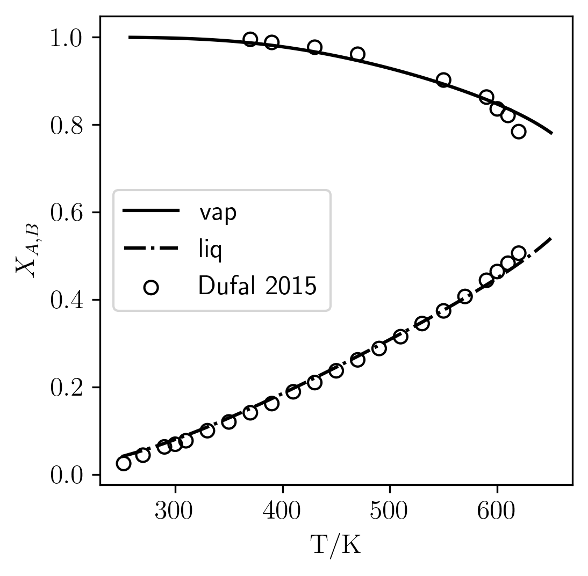

# Water 

<!-- The correspondent python code can be found at [pure_water.py](../../../python_examples/phase_equilibrium/pure_water.py). -->

## Initializing SCPA EOS

```python
import numpy as np

from reos.state import State
from reos.consts import Consts
from reos.cpa import CPAParameters
from reos.eos import EquationOfState


p = CPAParameters.from_json(["water"], 
ppath = "/parameters/cpa/kontogeorgis2006.json")
eos = EquationOfState.scpa(p)

see parameters object later
 
```

## Liquid-vapor equilibrium

```python
def calc_psat(t,p0):
    
    e = 1
    max = 100
    it = 0

    while abs(e) > 1e-8 and it < max:

        s1 = State.tpx(eos, t, p0, np.array([1.0]), 'vapor')
        s2 = State.tpx(eos, t, p0, np.array([1.0]), 'liquid')
        phiv = np.exp(s1.lnphi()[0])
        phil = np.exp(s2.lnphi()[0])

        r = phil / phiv

        p0 = p0 * r
        it += 1

    return p0, s1, s2
```

## Computing properties

```python
N = 100
T=np.linspace(250.0, 650, N)

PRES = np.zeros_like(T)
VAP = np.zeros_like(T,dtype=object)
LIQ = np.zeros_like(T,dtype=object)

XV = np.zeros_like(VAP,dtype=object)
XL = np.zeros_like(LIQ,dtype=object)

rhoV = np.zeros_like(VAP)
rhoL = np.zeros_like(LIQ)

entropyV = np.zeros_like(VAP)
entropyL = np.zeros_like(LIQ)

for (i,t) in enumerate(T):
    
    PRES[i], VAP[i], LIQ[i] = calc_psat(t, PRES[i-1] if i>0 else 1e5)
    
    liq = LIQ[i]
    vap = VAP[i]

    entropyL[i] = liq.entropy() 
    entropyV[i] = vap.entropy() 

    rhoV[i] = vap.density
    rhoL[i] = liq.density
```

<figure markdown="span">
  { width="800" }
  <figcaption></figcaption>
</figure>

## Non-associated sites fraction

To compute the unbondend sites fraction, just use the correspondent eos at the
points at the saturation states.

```python
for (i,t) in enumerate(T):
    
    ...

    XL[i] = eos.unbonded_sites_fraction(t, rhoL[i], np.array([1.0]))[0]
    XV[i] = eos.unbonded_sites_fraction(t, rhoV[i], np.array([1.0]))[0]
```

<figure markdown="span">
  { width="400" }
  <figcaption></figcaption>
</figure>
<!--  -->